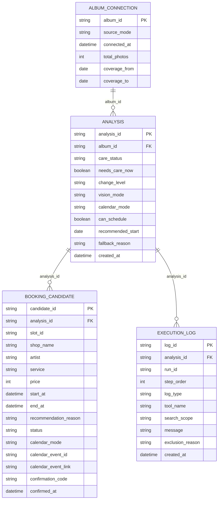

# 슬슬 논리 ERD (해커톤 제출용)

> **이 문서는 실제 DB 구현이 아니다.** 현재 백엔드는 DB나 ORM을 전혀 쓰지 않고,
> `backend/data/*.json` 고정 fixture와 `app/state.py`의 인메모리 `dict`(`InMemoryStore`)만으로
> MVP를 시연한다(프로세스를 재시작하면 모든 데이터가 사라진다). 아래 ERD는 **운영 환경으로
> 전환할 때 사용할 논리 데이터 모델**이며, 테이블명·컬럼명·enum 값은 실제 코드
> (`app/models/schemas.py`, `app/services/*.py`, `app/state.py`)의 실제 필드/값을 근거로 작성했다.
> 코드에 없는 상태값이나 필드는 이 문서에도 확정된 것처럼 적지 않았고, 있는 경우 그 사실을
> 명시했다.

## 1. 현재 데이터 저장 방식

- 영속 저장소가 없다. `app/state.py`의 `InMemoryStore`가 프로세스 메모리에만 3개의 `dict`를 둔다:
  `analyses`(analysis_id → `AnalyzeResponse.model_dump()`), `schedules`(analysis_id →
  `ScheduleResponse.model_dump()`), `candidates`(candidate_id → candidate dict + `analysisId`).
- `POST /api/albums/connect`는 **아무것도 저장하지 않는다.** `backend/data/album.json`을 매 요청마다
  읽어 응답만 만들고 반환한다 — 서버 쪽에 "연결됨" 상태나 connection 레코드가 없다.
- `evidenceLogs`(분석 단계 로그)와 `executionLogs`(schedule/retry 단계 로그)는 별도 테이블/저장소가
  아니라 각각 `AnalyzeResponse`/`ScheduleResponse`/`RetryResponse` 안에 내장된 JSON 배열이다.
- `POST /api/analyses/{id}/retry`의 응답(`RetryResponse`, 그 안의 `executionLogs` 포함)은 **저장되지
  않는다** — HTTP 응답으로 반환된 뒤 사라진다. `store.schedules`는 `/schedule`의 응답만 담고,
  그마저도 analysis_id로 덮어쓰기 때문에 같은 analysis로 `/schedule`을 두 번 부르면 첫 번째 실행
  기록은 `store.schedules`에서 사라진다(다만 그 실행이 만든 `booking_candidate`들은 별도 dict라 남는다).
- 즉, 지금 실제로 "여러 행이 쌓이는" 것은 `candidates` dict뿐이다(candidate_id가 매 실행마다
  `{runId}_{slotId}`로 새로 생겨 서로 겹치지 않기 때문). `analyses`/`schedules`는 최신 상태만 덮어쓰는
  단일 레코드에 가깝다.

## 2. 논리 ERD (Mermaid)

- 실선 `||--o{`는 "1 : N (자식 nullable 아님, 부모 필수)"를 의미한다. `ALBUM_CONNECTION`은
  "코드 구조상 자연스러우면 포함"이라는 조건부 요청으로 추가했다 — 실제로는 이 관계에 대응하는
  저장 레코드가 지금 코드에 없다(1번 섹션 참고). `analysis.album_id`는 현재도 실제 문자열 값으로
  존재하므로(`AnalyzeRequest.albumId`, `AnalyzeResponse.albumId`), 이 FK 자체는 근거가 있다.

## 3. 테이블별 상세 명세

### 3.1 `album_connection` (조건부 포함 — 근거: 4번 참고)

| 컬럼 | 논리 타입 | PK/FK | Nullable | 설명 | 근거 (코드) |
|---|---|---|---|---|---|
| `album_id` | string | PK | N | 앨범 식별자. 현재는 `album.json`의 고정값 `"album-001"` 하나뿐 | `mock_data.ALBUM_ID`, `AnalyzeRequest.albumId` |
| `source_mode` | string (enum) | | N | 연결 소스. 현재 값은 `"DEMO"` 하나뿐(실제 사진첩 접근 없음) | `ConnectAlbumRequest.source: Literal["DEMO"]` |
| `connected_at` | datetime | | N | 연결 시각(ISO 8601, Asia/Seoul) | `ConnectAlbumResponse.connectedAt` |
| `total_photos` | int | | N | 앨범 사진 수. 현재 항상 6 | `ScanSummary.totalPhotos` |
| `coverage_from` | date | | N | 사진 촬영일 범위 시작 | `ScanSummary.coveragePeriod.from` |
| `coverage_to` | date | | N | 사진 촬영일 범위 끝 | `ScanSummary.coveragePeriod.to` |

- **인덱스/제약**: `album_id` UNIQUE(PK). 실제 운영에서 사용자별 앨범이 여러 개면 PK를
  `connection_id`(발급 시점 UUID)로 바꾸고 `album_id`는 일반 컬럼 + INDEX로 내리는 편이 자연스럽다.
- **현재 구현과의 차이**: 이 테이블에 대응하는 저장/조회 코드가 전혀 없다. `POST /api/albums/connect`는
  매 요청마다 `album.json`을 다시 읽어 응답만 만들 뿐 어디에도 쓰지 않는다.

### 3.2 `analysis`

| 컬럼 | 논리 타입 | PK/FK | Nullable | 설명 | 근거 (코드) |
|---|---|---|---|---|---|
| `analysis_id` | string | PK | N | 분석 식별자. `analysis_{YYYYMMDDHHMMSS}_{4자리}` | `routes._new_id("analysis")`, `AnalyzeResponse.analysisId` |
| `album_id` | string | FK → `album_connection.album_id` | N | 대상 앨범 | `AnalyzeResponse.albumId` |
| `care_status` | string (enum) | | N | 관리 시점 판정 결과 | `CareStatus.status` |
| `needs_care_now` | boolean | | N | `care_status`와 동일 정보를 boolean으로 | `CareStatus.needsCareNow` |
| `change_level` | string (enum) | | N | Vision이 판단한 변화 크기 | `ChangeSignal.level` |
| `vision_mode` | string (enum) | | N | 이번 분석에 실제 사용된 Vision 모드 | `AnalyzeResponse.visionMode` |
| `calendar_mode` | string (enum) | | N | 이번 분석에 **실제 사용된** Calendar 모드(요청값이 아니라 실제 성공한 모드) | `AnalyzeResponse.calendarMode`, `calendar_service.resolve_upcoming_event()` |
| `can_schedule` | boolean | | N | `/schedule` 호출 가능 여부 | `AnalyzeResponse.canSchedule` |
| `recommended_start` | date | | Y | 역방향 권장 구간 시작. `reversePlan`이 없으면 NULL | `ReversePlan.recommendedStart` |
| `recommended_end` | date | | Y | 역방향 권장 구간 끝. `reversePlan`이 없으면 NULL | `ReversePlan.recommendedEnd` |
| `fallback_reason` | string | | Y | Vision/Calendar LIVE 실패 사유(둘 다 있으면 `"; "`로 연결). 실패 없으면 NULL | `AnalyzeResponse.fallbackReason` |
| `created_at` | datetime | | N | 분석 실행 시각 | `careStatus.decidedAt`과 동일 값(= `routes.py`의 `decided_at`) — `AnalyzeResponse`에 별도 최상위 타임스탬프 필드는 없다 |

- **인덱스/제약**: `analysis_id` UNIQUE(PK). `album_id`에 INDEX(앨범별 분석 이력 조회용). 참고: 현재
  `analysis_id`는 초 단위 타임스탬프 + 랜덤 4자리 조합이라 이론상 충돌 가능하다 — 지금은 단일
  프로세스 dict의 key라 충돌해도 조용히 덮어써질 뿐이다. 운영 전환 시 UUID나 DB 시퀀스로 바꿔야 한다.
- `care_status`가 `"NOW"`인데 `recommended_start`가 NULL인 경우가 있다(임박 일정 없이 순수 주기로만
  `canSchedule=true`가 되는 경우) — 이때 `/schedule`은 `reversePlan`이 없다는 이유로 409를 반환하므로,
  이 조합은 논리적으로 "분석은 됐지만 예약 탐색은 불가"한 상태다.

### 3.3 `booking_candidate`

| 컬럼 | 논리 타입 | PK/FK | Nullable | 설명 | 근거 (코드) |
|---|---|---|---|---|---|
| `candidate_id` | string | PK | N | `{scheduleRunId 또는 retryRunId}_{slotId}` 형태. 실행마다 새로 생겨 다른 실행과 겹치지 않는다 | `policy.prepare_candidates_from_slot_ids()` |
| `analysis_id` | string | FK → `analysis.analysis_id` | N | 이 후보를 만든 분석 | `routes.py`가 candidate dict에 덧붙임(`{**candidate.model_dump(), "analysisId": analysis_id}`) — **`Candidate` API 스키마 자체에는 없는 필드**, 저장소 내부에만 존재 |
| `slot_id` | string | | N | 네일샵 슬롯 식별자(`nail_shop_slots.json` 참조) | `Candidate.slotId` |
| `shop_name` | string | | N | 매장명 | `Candidate.shop` |
| `artist` | string | | N | 담당 아티스트 | `Candidate.artist` |
| `service` | string | | N | 시술 종류. 현재 값은 `"GEL_NAIL"` 하나뿐 | `Candidate.service` |
| `price` | int | | N | 가격(원) | `Candidate.price` |
| `start_at` | datetime | | N | 예약 시작 시각(ISO 8601, Asia/Seoul) | `Candidate.start` |
| `end_at` | datetime | | N | 예약 종료 시각 | `Candidate.end` |
| `recommendation_reason` | string (enum) | | N | 추천 사유(화이트리스트, LLM이 생성하지 않음) | `Candidate.recommendationReason` |
| `status` | string (enum) | | N | 후보 상태 | `Candidate.status` |
| `calendar_mode` | string (enum) | | Y | confirm 시점에 실제 사용된 Calendar 모드. 아직 confirm 안 됐으면 NULL | `ConfirmResponse.calendarMode` |
| `calendar_event_id` | string | | Y | 실제 생성된 Google Calendar 이벤트 ID(`sls` + candidate_id의 sha256 앞 40자, 결정론적). CACHED거나 미확정이면 NULL | `CalendarEventResult.eventId`, `calendar_service._deterministic_event_id()` |
| `calendar_event_link` | string | | Y | Google Calendar 이벤트 링크. 위와 동일 조건 | `CalendarEventResult.htmlLink` |
| `confirmation_code` | string | | Y | 네일샵 예약 시뮬레이션 코드(`SIM-...`, 항상 시뮬레이션). 미확정이면 NULL | `ShopBooking.confirmationCode` |
| `confirmed_at` | datetime | | Y | 확정 시각. `status != "CONFIRMED"`면 NULL | `ConfirmResponse.confirmedAt` |

- **인덱스/제약**: `candidate_id` UNIQUE(PK). `analysis_id`에 INDEX. `calendar_event_id`는 값이 있을 때
  UNIQUE(같은 Google 이벤트가 두 candidate에 연결되면 안 된다 — 실제로 `create_event()`가 409 발생 시
  `extendedProperties.private.candidateId` 일치를 확인해 이 무결성을 코드 레벨로 보장하고 있다).
- **현재 구현과의 차이**: `address`(매장 주소) 필드는 넣지 않았다 — `calendar_service._build_event_body()`가
  `candidate.get("address")`를 optional로 읽지만, 실제 어떤 데이터 경로도 candidate에 `address`를
  채워 넣지 않는다(항상 매장명만 location으로 쓰인다). `shop_id`도 별도로 없다 — `shop_name`이 곧
  네일샵 식별 정보의 전부다.

### 3.4 `execution_log`

`evidenceLogs`(분석 단계)와 `executionLogs`(schedule/retry 단계)를 하나의 논리 테이블로 합쳤다 —
둘 다 "analysis에 속한, step 순서가 있는 로그 한 줄"이라는 같은 모양이기 때문이다. 분석 단계 행은
`tool_name`이 항상 NULL이고, schedule/retry 단계 행만 `tool_name`/`search_scope`/`exclusion_reason`을 쓴다.

| 컬럼 | 논리 타입 | PK/FK | Nullable | 설명 | 근거 (코드) |
|---|---|---|---|---|---|
| `log_id` | string | PK | N | 로그 행 식별자. **현재 코드에는 없다** — 지금은 응답 JSON 배열의 인덱스가 그 역할을 대신한다. 운영 전환 시 새로 발급해야 한다 | (신규 발급 필요) |
| `analysis_id` | string | FK → `analysis.analysis_id` | N | 이 로그가 속한 분석 | `AnalyzeResponse.evidenceLogs`, `ScheduleResponse.executionLogs`는 응답에 `analysisId`와 함께 반환됨 |
| `run_id` | string | | Y | `scheduleRunId`/`retryRunId`. 분석 단계(evidenceLogs) 행이면 NULL | `ScheduleResponse.scheduleRunId`, `RetryResponse.retryRunId` |
| `step_order` | int | | N | 실행 순서(1부터 증가) | `EvidenceLogEntry.step`, `ExecutionLogEntry.step` |
| `log_type` | string (enum) | | N | 로그 종류. 요청에서 말한 "status" 역할을 하는 필드 — 실제 코드 필드명은 `type`이다 | `EvidenceLogEntry.type`, `ExecutionLogEntry.type` |
| `tool_name` | string (enum) | | Y | 호출된 Agent Tool 이름. `log_type IN (SYSTEM, POLICY, AGENT, VISION, CALENDAR)`면 NULL | `ExecutionLogEntry.tool` |
| `search_scope` | string (enum) | | Y | `THIS_WEEK`/`NEXT_WEEK`. **현재 코드에서는 이 필드가 항상 NULL로 기록된다**(schema에는 있지만 `EventCollector.record()`가 무조건 `None`을 넣음) | `ExecutionLogEntry.searchScope`, `app/agent/context.py: EventCollector.record()` |
| `message` | string | | N | 사람이 읽는 로그 메시지(결정론 코드가 생성, LLM 생성 문장 아님) | `EvidenceLogEntry.message`, `ExecutionLogEntry.message` |
| `exclusion_reason` | string (enum) | | Y | 슬롯이 제외된 이유. 해당 없으면 NULL | `ExecutionLogEntry.exclusionReason` |
| `created_at` | datetime | | N | **현재 코드에는 로그 행 단위 타임스탬프가 없다** — 모든 로그가 같은 요청의 `demo_clock.now()` 고정 시각을 공유한다고 가정하거나, 운영 전환 시 새로 기록해야 한다 | (신규 발급 필요, 근거 없음) |

- **인덱스/제약**: `log_id` UNIQUE(PK, 신규). `(analysis_id, run_id, step_order)`에 복합 INDEX(실행별
  순서 조회용).
- **현재 구현과의 차이**: `result`(Tool/Policy 실행의 구조화된 결과 dict)는 이 표에 넣지 않았다 —
  `EvidenceLogEntry.result`/`ExecutionLogEntry.result`는 자유 형식 JSON(`Optional[dict]`)이라
  관계형 컬럼으로 정규화하기보다 JSON/JSONB 컬럼으로 그대로 옮기는 편이 실제 코드 구조에 더 가깝다.
  운영 전환 시 `result_json`(JSONB, nullable) 컬럼 추가를 권장한다.

## 4. 주요 상태값 (코드에서 실제로 확인한 값만)

| 필드 | 스키마 선언(`Literal`) | **실제로 코드가 만들어내는 값** | 비고 |
|---|---|---|---|
| `booking_candidate.status` | `PREPARED`, `CONFIRMED` | `PREPARED`, `CONFIRMED` | 선언과 실제가 정확히 일치 |
| `analysis.care_status` | `NOW`, `SOON`, `FRESH` | `NOW`, `FRESH`만 실제 반환됨 | `policy.decide_care_status()`는 `due`가 true면 `NOW`, 아니면 `FRESH`만 반환한다 — `SOON`은 스키마에 선언돼 있지만 현재 정책 함수가 만들어내지 않는다 |
| `analysis.change_level` | `LOW`, `MEDIUM`, `HIGH` | 3개 모두 실제 가능(Vision 응답/`vision_cache.json` 값에 따름) | |
| `booking_candidate.recommendation_reason` | `권장 관리 구간 내`, `Calendar 충돌 없음`, `선호 네일샵`, `빠른 예약 가능 시간` | `권장 관리 구간 내`, `선호 네일샵`, `빠른 예약 가능 시간` 3개만 실제 반환됨 | `policy.determine_recommendation_reason()`이 `"Calendar 충돌 없음"`(`RECOMMENDATION_REASON_NO_CONFLICT`)을 반환하는 경로가 없다 — 상수만 정의돼 있고 미사용 |
| `execution_log.exclusion_reason` | `CALENDAR_BUSY`, `OUTSIDE_SEARCH_SCOPE`, `SHOP_UNAVAILABLE` | `CALENDAR_BUSY`, `OUTSIDE_SEARCH_SCOPE` 2개만 실제 반환됨 | `policy.find_eligible_and_excluded_slots()`가 `SHOP_UNAVAILABLE`을 반환하는 경로가 없다 |
| `analysis.vision_mode` | `LIVE`, `CACHED` | 둘 다 실제 가능 | `VISION_MODE` 환경변수 |
| `analysis.calendar_mode` / `booking_candidate.calendar_mode` | `LIVE`, `CACHED` | 둘 다 실제 가능(성공/fallback에 따라 실제 사용된 값) | |
| (참고) `/schedule`, `/retry` 응답의 `agentMode` | `LIVE`, `FALLBACK`, `CACHED` | `LIVE`, `FALLBACK` 2개만 실제 반환됨(booking_candidate 테이블에는 없는 필드, 참고용) | `schedule_service._execute_agent_or_fallback()`은 `"LIVE"` 또는 `"FALLBACK"`만 반환한다. `"CACHED"`는 `GET /api/health`가 환경변수를 그대로 echo할 때만 나올 수 있는 값이다(검증 없음) |
| `execution_log.log_type` (evidenceLogs) | `SYSTEM`, `VISION`, `POLICY`, `CALENDAR` | 4개 모두 실제 사용됨 | |
| `execution_log.log_type` (executionLogs) | `TOOL`, `POLICY`, `AGENT`, `SYSTEM` | 4개 모두 실제 사용됨 | |
| `execution_log.tool_name` | `get_calendar_busy_times`, `search_nail_shop_slots`, `prepare_booking_candidates` | 3개 모두 실제 사용됨(Agent Tool 정확히 3개) | |

## 5. 실제 서비스 전환 시 영속화 범위

운영 DB로 전환한다면 최소한 다음을 실제로 저장해야 한다(현재는 전부 인메모리 또는 미저장):

1. **`analysis` 전체 행** — 지금은 프로세스가 죽으면 사라진다. 관리 시점 판정 이력을 사용자에게
   보여주거나(예: "지난 분석과 비교") 감사(audit)하려면 영속화가 필수다.
2. **`booking_candidate`의 confirm 이후 필드** (`status`, `calendar_event_id`, `calendar_event_link`,
   `confirmed_at`) — 실제 예약/Calendar 이벤트 상태의 유일한 기록이다. 지금은 이것도 인메모리라
   서버 재시작 시 "확정했다는 사실"과 "그 Google 이벤트에 다시 연결되는 경로"가 함께 사라진다
   (`_deterministic_event_id()`로 재계산은 되지만, 로컬 `status=CONFIRMED` 기록 자체는 복구되지 않는다).
3. **`execution_log`(특히 `run_id` 단위)** — 지금은 `/retry`의 로그가 아예 저장되지 않고,
   `/schedule`의 로그도 analysis당 최신 1건만 남는다. 여러 번의 탐색 시도를 비교하거나 디버깅하려면
   `run_id`별로 별도 행이 쌓여야 한다.
4. **`album_connection`** — 현재 단일 데모 앨범이라 우선순위가 낮지만, 다중 사용자/다중 앨범으로
   확장하면 "언제 어떤 소스로 연결했는지"를 남길 근거가 된다.
5. 반대로 **캐시성 데이터**(`backend/data/*.json` fixture: `album.json`, `calendar_events.json`,
   `nail_shop_slots.json` 등)는 소스 데이터 원본이 아니라 참조용 스냅샷이므로, DB에 그대로 옮기기보다
   외부 시스템(사진첩 API, 네일샵 예약 시스템)과의 연동 시점에 재설계하는 것이 맞다 — 이 ERD의
   범위에 포함하지 않았다.

## 6. 현재 MVP에서 구현되지 않은 항목

- 실제 DB/ORM/마이그레이션이 없다 — `SQLAlchemy`, `Alembic` 등 어떤 DB 라이브러리도 이 저장소에 없다.
- `POST /api/albums/connect`는 아무 상태도 저장하지 않는다(1번 섹션 참고) — `album_connection`
  테이블에 대응하는 실제 레코드 생성 코드가 없다.
- `execution_log.log_id`, `created_at`(로그 행 단위)은 현재 코드에 대응하는 값이 없다 — 신규 발급이
  필요하다.
- `/retry`의 `executionLogs`는 응답으로만 나가고 어디에도 저장되지 않는다.
- `/schedule`의 실행 기록(`store.schedules`)은 `analysis_id`로 덮어써져 최신 1건만 남는다 — 여러 번
  `/schedule`을 호출한 이력은 남지 않는다(그 실행이 만든 `booking_candidate`들은 남는다).
- `booking_candidate.calendar_event_id`/`calendar_event_link`에 대한 **UNIQUE 제약은 DB 차원이
  아니라 코드 로직**(`create_event()`의 409 처리 시 `candidateId` 일치 검증)으로만 보장된다.
- 스키마에 선언됐지만 실제로 발생하지 않는 값들이 있다(`care_status="SOON"`,
  `recommendation_reason="Calendar 충돌 없음"`, `exclusion_reason="SHOP_UNAVAILABLE"`,
  `agentMode="CACHED"`) — 4번 섹션에 표로 정리했다. 이 값들을 "확정된 구현"으로 취급하지 않았다.
- 사용자/인증/권한 모델이 없다 — 이 저장소는 단일 데모 사용자만 가정한다(CLAUDE.md 절대 범위 참고).
  이 ERD에도 `user` 테이블을 추가하지 않았다.
